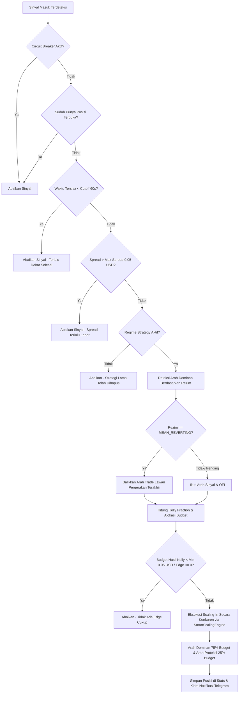

# Panduan Strategi Dual-Side Scaling & Regime Adaptation
## Polymarket BTC Binary Options (5-Minute Cycles)

Panduan ini menjelaskan arsitektur, parameter, alur kerja, dan konfigurasi dari bot trading otomatis untuk opsi biner Polymarket BTC (5-menit) yang menggunakan strategi **Dual-Side Scaling & Regime Adaptation**.

---

## 1. Konsep Utama & Mekanisme Kerja

Strategi ini dirancang untuk memaksimalkan *expected value* (EV) sambil menekan risiko kebangkrutan (*drawdown*) pada pasar biner Polymarket dengan mengandalkan empat pilar utama:

### 1.1 Deteksi Rezim Pasar (Regime Detection)
Bot mendeteksi perilaku tren harga Bitcoin secara real-time menggunakan dua indikator kuantitatif:
1. **Hurst Exponent ($H$)**: Mengukur memori jangka panjang dari pergerakan harga BTC (menggunakan $ddof=1$ untuk sample standard deviation agar tidak bias).
   - $H > 0.55$: **TRENDING** (harga cenderung searah).
   - $H < 0.45$: **MEAN_REVERTING** (harga cenderung berbalik arah).
   - $0.45 \le H \le 0.55$: **NEUTRAL** (acak/random walk, bot tidak agresif).
2. **Order Flow Imbalance (OFI)**: Mengukur tekanan beli/jual dari order book tingkat 3 (top 3 levels). OFI positif menunjukkan akumulasi beli, sedangkan OFI negatif menunjukkan tekanan jual.

### 1.2 Penentuan Sizing (Modified Kelly Criterion)
Untuk menentukan porsi saldo yang dimasukkan ke pasar, bot menggunakan rumus Kelly Criterion yang dimodifikasi (*Half-Kelly* untuk mengurangi volatilitas saldo):
- **Standard Kelly**: Menghitung alokasi fraksional murni berdasarkan estimasi *win rate* dan harga token saat ini.
- **Conservative Kelly**: Membatasi risiko lebih ketat dengan mensyaratkan minimal estimasi *win rate* 55%, minimal edge keuntungan 2%, harga token berada di rentang wajar (0.30 - 0.70), dan batas maksimal fraksi saldo adalah 15%.
- Bot akan memilih nilai fraksi terkecil dari kedua kalkulasi ini untuk proteksi maksimal.

### 1.3 Alokasi Dua Sisi (Dual-Side Split 75/25)
Ketika arah dominan terkonfirmasi oleh rezim pasar, bot tidak menaruh seluruh budget pada satu sisi saja, melainkan membaginya:
- **75% untuk Dominant Token** (misalnya UP jika tren naik).
- **25% untuk Insurance/Trap Token** (misalnya DOWN untuk mengunci sebagian keuntungan atau meminimalkan kerugian jika terjadi pembalikan harga mendadak).
*Catatan: Jumlah alokasi dominant + insurance wajib bernilai 1.0 (100%).*

### 1.4 Smart Scaling-In Engine
Eksekusi order biner Polymarket dilakukan secara bertahap menggunakan **Smart Scaling-In Engine**:
- Budget dibagi rata menjadi **N slices** (misal 10 slices) dan dieksekusi secara periodik (misal setiap 12 detik dalam durasi 120 detik).
- **Maker-First Pricing**: Bot menempatkan order limit beli (`best_bid + offset`) secara dinamis di setiap slice, meningkat perlahan tanpa mengejar harga ask secara agresif untuk menghemat biaya transaksi (mengincar rebate/maker fee).
- **Taker Fallback (Slice 8+)**: Jika hingga slice ke-8 target kontrak belum terpenuhi karena harga menjauh, bot secara otomatis beralih menggunakan order pasar (*market/taker order*) untuk sisa kontrak agar posisi tetap terisi sebelum siklus pasar 5-menit berakhir.

---

## 2. Parameter Ideal dalam `config.json`

Berikut adalah contoh konfigurasi optimal yang dirancang untuk menjaga konsistensi profitabilitas dan meminimalisir risiko drawdown:

```json
{
  "market": {
    "interval_minutes": 5
  },
  "regime_strategy": {
    "enabled": true,
    "total_budget_usd": 20.00,
    "hurst_threshold_trending": 0.55,
    "hurst_threshold_mean_revert": 0.45,
    "dominant_allocation_pct": 0.75,
    "insurance_allocation_pct": 0.25,
    "scaling_parts": 10,
    "scaling_duration_sec": 120.0,
    "max_consecutive_losses": 3,
    "circuit_breaker_duration_min": 15,
    "max_spread_usd": 0.05
  },
  "strategy": {
    "min_price": 0.30,
    "max_price": 0.70,
    "min_elapsed_sec": 60,
    "min_deviation_pct": 1.0,
    "no_entry_before_end_sec": 60
  },
  "entry": {
    "bet_amount_usd": 2.00,
    "price_offset": 0.01,
    "order_type": "FAK",
    "max_retries": 3,
    "retry_delay_ms": 300,
    "fill_timeout_ms": 1000,
    "min_contracts": 1,
    "min_order_usd": 0.01,
    "max_entry_price": 0.75,
    "ws_recovery_timeout_sec": 10,
    "max_daily_trades": 20,
    "daily_stop_loss_usd": -5.0
  },
  "hedge": {
    "enabled": false
  },
  "simulation": {
    "enabled": true,
    "separate_trading_log": true,
    "trading_log_path": "logs/trading_log_sim.json",
    "history_csv_path": "logs/simulation_trades.csv",
    "history_jsonl_path": "logs/simulation_history.jsonl",
    "history_summary_path": "logs/simulation_summary.json"
  },
  "telegram": {
    "enabled": false,
    "bot_token": "YOUR_BOT_TOKEN",
    "chat_id": "YOUR_CHAT_ID",
    "chart_every_n_trades": 10
  },
  "web_dashboard": {
    "enabled": true,
    "host": "127.0.0.1",
    "port": 8765
  },
  "logging": {
    "level": "INFO",
    "file_rotation_hours": 3
  }
}
```

---

## 3. Alur Pengambilan Keputusan & Eksekusi Entry

Setiap kali bot menerima pembaruan data harga dan order book dari WebSocket, bot mengikuti alur logika berikut di dalam `execute_entry()` di [main.py](file:///c:/Users/Zuhri/Documents/apps/polymarket-trade/btc-binary-VWAP-Momentum-bot/main.py):



---

## 4. Panduan Manajemen Risiko & Proteksi Modal

Agar Anda bisa memperoleh hasil trading yang konsisten, pastikan bot menerapkan batasan risiko berikut yang telah terpasang di kode program:

1. **Circuit Breaker (Pengaman Beruntun)**:
   - Jika bot mengalami kekalahan beruntun sebanyak 3 kali (`max_consecutive_losses: 3`), bot akan mengaktifkan Circuit Breaker secara otomatis.
   - Semua entri baru akan diblokir selama 15 menit (`circuit_breaker_duration_min: 15`). Ini berguna untuk mengistirahatkan bot saat pasar sedang dalam kondisi bergejolak ekstrem (*extreme noise*).
2. **Daily Stop-Loss (Batasan Harian)**:
   - Jika akumulasi kerugian dalam 1 hari UTC menyentuh `-5.0 USD` (`daily_stop_loss_usd: -5.0`), bot akan berhenti mengeksekusi perdagangan baru hingga hari UTC berganti.
3. **No-Entry Cutoff**:
   - Bot tidak akan membuka posisi baru di sisa waktu 60 detik terakhir sebelum siklus 5-menit selesai (`no_entry_before_end_sec: 60`). Hal ini untuk menghindari risiko slippage tinggi dan ketidakmampuan keluar dari pasar tepat waktu.
4. **Spread Gate**:
   - Jika selisih harga terbaik beli dan jual (*best bid/ask spread*) melebihi `0.05 USD`, bot akan membatalkan eksekusi perdagangan per slice tersebut untuk mencegah kerugian langsung akibat *bid-ask gap*.

---

## 5. Langkah Menjalankan Bot secara Konsisten

### Langkah 1: Pengujian Awal (Simulation Mode)
Selalu jalankan bot pertama kali dalam mode simulasi (*paper trading*) untuk menguji kestabilan koneksi dan parameter di lingkungan lokal Anda.
1. Pastikan `"simulation": {"enabled": true}` terpasang di `config.json`.
2. Jalankan program utama:
   ```bash
   python main.py
   ```
3. Buka browser dan arahkan ke alamat web dashboard lokal Anda (biasanya `http://127.0.0.1:8765/`) untuk melihat visualisasi pergerakan harga, Hurst Exponent, OFI, dan catatan P&L simulasi Anda.

### Langkah 2: Mode Live Trading (Real Capital)
Setelah parameter terbukti konsisten di mode simulasi, Anda dapat beralih ke perdagangan riil:
1. Ubah `"simulation": {"enabled": false}` di `config.json`.
2. Isi kredensial API Polymarket Anda pada file `.env` (pastikan privat key dan alamat funder terisi dengan benar).
3. Jalankan kembali `python main.py`.
