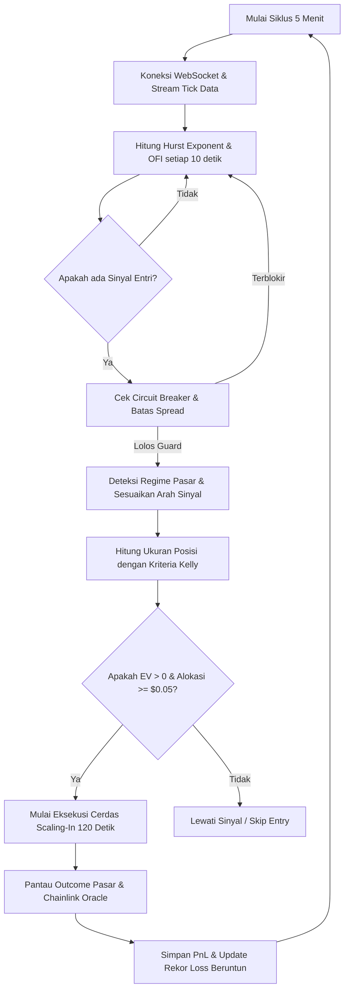

# Panduan Cara Kerja Bot & Strategi Kelly Criterion

Dokumen ini menjelaskan secara mendalam tentang arsitektur operasional, logika pengambilan keputusan, strategi matematika Kelly, dan mekanisme eksekusi cerdas yang diterapkan pada bot trading Polymarket Anda.

---

## 1. Siklus Hidup Operasional (Bagaimana Bot Bergerak)

Bot beroperasi dalam siklus waktu 5 menit yang berulang mengikuti siklus pasar Polymarket (BTC Up/Down 5m). Berikut adalah alur pergerakan bot setiap siklusnya:

---

## 2. Bagaimana Bot Mengambil Keputusan yang Tepat

Bot memadukan dua indikator utama untuk mengklasifikasikan kondisi pasar secara real-time:

### A. Hurst Exponent ($H$) - Detektor Rezim
Hurst Exponent mengukur tingkat persistensi (kecenderungan tren) dari pergerakan harga BTC:
*   **$H > 0.55$ (Rezim TRENDING):** Pasar sedang dalam tren searah yang kuat. Bot akan **mengikuti arah sinyal awal** (membeli UP jika harga naik, DOWN jika harga turun).
*   **$H < 0.45$ (Rezim MEAN-REVERTING):** Pasar cenderung memantul kembali (*sideways*). Bot akan **membalikkan arah sinyal** (jika sinyal menyuruh beli UP, bot justru akan membeli DOWN) karena harga diproyeksikan segera berbalik arah.
*   **$0.45 \le H \le 0.55$ (Rezim NEUTRAL):** Pasar acak/konsolidasi. Bot berjalan normal sesuai arah sinyal awal.

### B. Order Flow Imbalance (OFI) - Konfirmasi Tekanan Beli/Jual
OFI mengukur dominasi volume agresif di top 3 level order book. Indikator ini digunakan sebagai filter konfirmasi akhir:
*   Jika sinyal adalah **BUY_UP** dan regime adalah **TRENDING**, maka OFI harus bernilai **positif** (tekanan beli mendominasi) sebelum order benar-benar dikirimkan.

---

## 3. Strategi Alokasi Modal Kelly Criterion

Bot menggunakan pendekatan matematis **Kelly Criterion** untuk menentukan besarnya ukuran taruhan secara optimal berdasarkan probabilitas kemenangan historis ($p$) dan harga kontrak Polymarket saat ini ($P$):

### A. Rumus Kelly Binary Options
$$f^* = \frac{p(1 - P) - (1 - p)P}{P(1 - P)}$$

*   $f^*$: Fraksi optimal saldo yang akan digunakan untuk taruhan.
*   $p$: Probabilitas kemenangan historis (diambil langsung secara dinamis dari tabel Win Rate berdasarkan tingkat harga saat ini).
*   $P$: Harga kontrak saat ini (misal: jika harga token UP = `$0.75`, maka $P = 0.75$).

### B. Proteksi Expected Value (EV) Negatif
Jika hasil perhitungan $f^* \le 0$, ini berarti **Expected Value (EV) dari taruhan tersebut adalah negatif** (potensi keuntungan tidak sebanding dengan risiko kerugian). Kelly Sizer secara otomatis akan menghasilkan alokasi **`$0.00`** dan **melewatkan perdagangan tersebut** demi menyelamatkan modal Anda dari transaksi berspesifikasi buruk.

### C. Setengah-Kelly (Half-Kelly Safety Factor)
Untuk menghindari penurunan saldo ekstrem (*drawdown*) akibat variansi jangka pendek, bot menerapkan **Half-Kelly** ($0.5 \times f^*$). Ini memotong ukuran taruhan menjadi setengah dari ukuran teoretis maksimal, menghasilkan pertumbuhan saldo yang jauh lebih stabil dan aman.

---

## 4. Algoritma Eksekusi Cerdas (Smart Scaling-In)

Alih-alih melakukan pembelian sekaligus (*lump sum*), bot memecah order Anda menggunakan metode **Time-Slicing** untuk memaksimalkan efisiensi biaya:

1.  **Maker Priority (Limit Orders Only):** Bot hanya mengirimkan **Limit Orders** untuk bertindak sebagai penyedia likuiditas (*maker*). Hal ini menghindari biaya taker fee Polymarket yang sangat mahal ($>3.5\%$).
2.  **Pembagian Posisi (Slicing):** Total modal yang dihitung oleh Kelly dipecah menjadi **10 bagian kecil**.
3.  **Time Interval:** Bot mengirimkan 1 bagian order setiap **12 detik** selama 2 menit pertama siklus pasar.
4.  **Dynamic Offset vs VWAP:** Harga limit order diletakkan tepat di sekitar harga pasar saat itu dengan offset dinamis mendekati VWAP agar order Anda segera terisi (*filled*) tanpa perlu melakukan pengejaran harga (*chasing*) yang tidak efisien.

---

## 5. Manajemen Risiko & Fail-Safe

*   **Consecutive Loss Circuit Breaker:** Jika bot mengalami kerugian berturut-turut sebanyak **5 kali**, bot secara otomatis menghentikan seluruh aktivitas trading selama **60 menit** (cooldown) untuk menghindari kerugian berkelanjutan saat pasar sedang anomali.
*   **Liquidity Spread Guard:** Sebelum melakukan order, bot memeriksa selisih harga terbaik bid-ask. Jika spread melebihi **5 sen ($0.05)**, eksekusi dibatalkan karena pasar dianggap kurang likuid dan berisiko memicu slippage tinggi.
